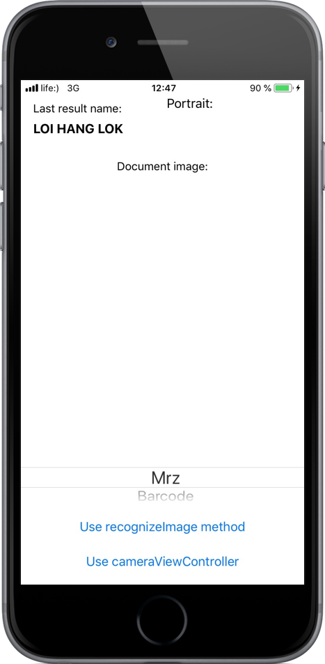
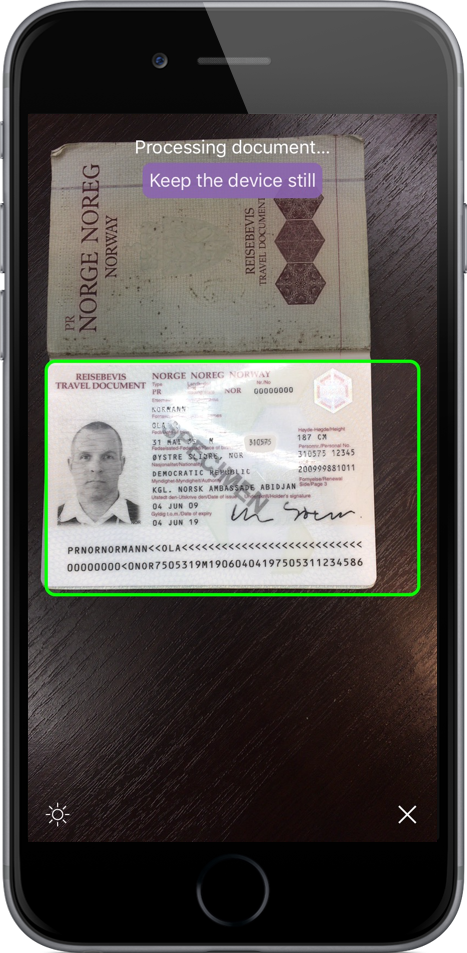
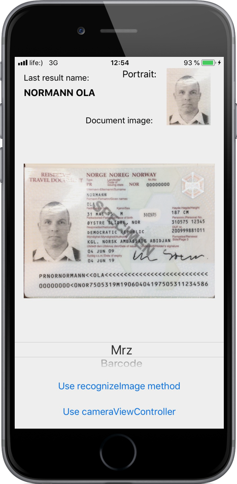

# Regula Document Reader (iOS version)

Regula Document Reader SDK allows you to read various kinds of identification documents, passports, driving licenses, ID cards, etc. All processing is performed completely ***offline*** on your device. No any data leaving your device.

You can use native camera to scan the documents or image from gallery for extract all data from it.

We have provided a simple application that demonstrates the ***API*** calls you can use to interact with the DocumentReader Library. [Just take me to the notes!](https://github.com/regulaforensics/DocumentReader-iOS/wiki)

  

# 

* [How to build demo application](#how_to_build_demo_application)
* [How to add DocumentReader library to your project](#how_to_add_documentreader_library_to_your_project)
* [Troubleshooting license issues](#troubleshooting_license_issues)
* [Additional information](#additional_information)

##  How to build demo application

You could easily use framework in both languages Swift or Objective C. 
1. Get trial license for demo application at [licensing.regulaforensics.com](https://licensing.regulaforensics.com) (`regula.license` file).
1. Download or clone current repository using command `git clone https://github.com/regulaforensics/DocumentReader-iOS.git`.
1. Download and install latest [Xcode](https://developer.apple.com/xcode/download).
1. Copy file `regula.license` to `Samples/DocumentReaderSwift-sample/DocumentReaderSwift-sample` folder or `Samples/DocumentReaderObjectiveC-sample/DocumentReaderObjectiveC-sample` for Objective C example.
1. Open workspace `Samples/DocumentReaderSwift-sample/DocumentReaderSwift-sample.xcworkspace` in Xcode or `Samples/DocumentReaderObjectiveC-sample/DocumentReaderObjectiveC-sample.xcworkspace` for Objective C sample.
1. Change bundle ID to specified during registration of your license key at [licensing.regulaforensics.com](https://licensing.regulaforensics.com) (`regula.DocumentReader` by default).
1. Select target `Pod install` and run it. Optionally you may install pods manually by running `pod install` in `Samples/DocumentReaderSwift-sample` directory

##  How to add DocumentReader to your project

DocumentReader is [available](https://cocoapods.org/pods/DocumentReader) via [CocoaPods](http://cocoapods.org/). To install it, simply add the following lines to your [Podfile](https://github.com/regulaforensics/DocumentReader-iOS/blob/master/Samples/DocumentReaderSwift-sample/Podfile):

`pod 'DocumentReader'`

And one of library depend on functionality which you want and license abilities:
* Install **Full** library edition:

`pod 'DocumentReaderFull'`
* Install **Core** library edition:

`pod 'DocumentReaderCore'`
* Install **Bounds** library edition:

`pod 'DocumentReaderBounds'`
* Install **Barcode** library edition:

`pod 'DocumentReaderBarcode'`
* Install **MRZ** library edition:

`pod 'DocumentReaderMRZ'`
* Install **MRZ-Barcode** library edition:

`pod 'DocumentReaderMRZBarcode'`
* Install **OCR** library edition:

`pod 'DocumentReaderOCR'`
* Install **Bank Card** library edition:

`pod 'DocumentReaderBankCard'`

##  Troubleshooting license issues
If you have issues with license verification when running the application, please verify that next is true:
1. OS you are using is the same as in the license you received (iOS).
1. Bundle ID is the same that you specified for license.
1. Date and time on the device you are trying to run the application is correct and inside the license validity period.
1. You are using the latest release of the SDK.
1. You placed the license into the correct folder as described here [How to build demo application](#how_to_build_demo_application) (`DocumentReaderSwift-sample/DocumentReaderSwift-sample`).

##  Additional information
Use [Wiki](https://github.com/regulaforensics/DocumentReader-iOS/wiki) to get more details.
If you have any technical questions, feel free to [contact us](mailto:support@regulaforensics.com) or creaite issue here.

To use our SDK in your own app you will need to [purchase](https://pipedrivewebforms.com/form/394a3706041290a04fbd0d18e7d7810f1841159) commercial license.
